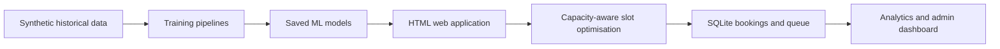

# Farmer Procurement Slot & Queue Management Using Machine Learning

A BSc Data Science mini-project with a Flask-powered HTML/CSS web interface that predicts procurement arrivals, waiting time and congestion, recommends capacity-available slots, and manages a token queue.

## Architecture


## Run locally
```bash
pip install -r requirements.txt
python generate_dataset.py
python train_models.py
python app.py
```

Optional environment variables (see `config.py`): `SECRET_KEY` to override
the Flask session secret, and `FLASK_DEBUG=true` to enable debug mode.

## Code structure

- `config.py` — slot definitions, capacities and Flask configuration in one place.
- `database/db.py` — SQLite access via context-managed connections (auto commit/rollback), with indexed, constrained tables.
- `app.py` — routes, prediction and slot-recommendation logic, with logging and input validation.
- `generate_dataset.py` / `train_models.py` — synthetic data and model training pipelines.

The generator creates 4,000 records labelled **Synthetic Historical Procurement Dataset created for academic/project demonstration**. Training calculates actual held-out metrics and stores Joblib models under `models/`. The application creates `procurement.db` on first run.

## Models and design

- Arrival prediction: Random Forest regression predicts actual farmer arrivals.
- Waiting-time prediction: Random Forest regression predicts minutes.
- Congestion prediction: Random Forest classification predicts Low, Medium, or High and supplies probabilities; probabilities are not guarantees.
- Clustering: K-Means identifies four recurring operational patterns.
- Slot recommendation: separate, transparent operational optimisation over ML outputs, bookings and capacity. It is not called an ML prediction.

Preprocessing uses a `ColumnTransformer`, imputation, and one-hot encoding inside the training pipeline; targets are excluded from features to avoid leakage.

## Report content

**Problem:** uneven procurement arrivals create crowding, unpredictable waits and inefficient staff/machine allocation. **Method:** construct realistic relationship-driven historical data; train evaluated pipelines; compare available slots; issue tokens; and monitor booking status. **Results:** report the live evaluation values printed by `train_models.py`, rather than invented scores. **Limitation:** synthetic records demonstrate the workflow but cannot establish real-world accuracy; deploy only after collecting local centre data.

Open `http://127.0.0.1:5000` in a browser after starting the application.

## Presentation content

1. Problem and objectives
2. End-to-end architecture
3. Dataset columns and realistic relationships
4. Feature preprocessing and anti-leakage measures
5. Actual held-out evaluation metrics
6. ML prediction versus slot optimisation
7. Booking and token queue demonstration
8. Limitations and future work

## Viva questions and answers

1. **Why use pipelines?** They ensure identical preprocessing during training and prediction.
2. **Why Random Forest?** It handles nonlinear operational relationships with limited tuning.
3. **What is data leakage?** Information about a target reaching model features, producing unrealistically good evaluation.
4. **Are congestion probabilities certain?** No; they express the model's learned confidence, not a guarantee.
5. **Why K-Means?** It groups similar historical operating situations without target labels.
6. **How is a slot selected?** Lowest operational score among slots that retain capacity.
